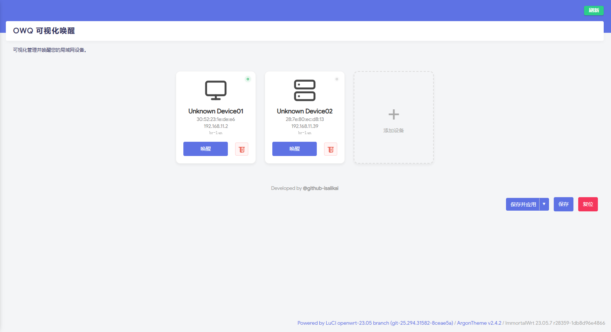
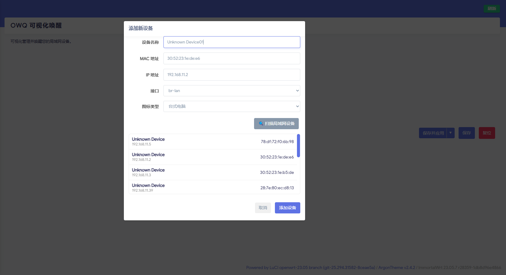

# luci-app-owq-wol


**OWQ Visual WOL** is a modern, card-style Wake-on-LAN tool for OpenWrt LuCI. It features real-time status monitoring, LAN device scanning, and multi-interface support.

**OWQ 可视化唤醒** 是一款专为 OpenWrt LuCI 设计的现代化网络唤醒工具。它采用美观的卡片式界面，支持实时在线状态监测、局域网设备扫描以及多接口唤醒功能。

---


## ✨ Features / 功能亮点

* **🎨 Modern Card UI**: Goodbye boring lists. Manage devices with elegant cards.
    * **卡片式界面**：告别枯燥的列表，使用优雅的卡片管理设备。
* **🟢 Real-time Status**: Automatic Ping detection. Green dot = Online, Gray = Offline.
    * **实时状态监测**：自动 Ping 检测设备状态。绿灯代表在线，灰灯代表离线。
* **🔍 LAN Scanner**: One-click scan to discover devices from ARP/DHCP tables. No need to type MACs manually.
    * **局域网扫描**：一键扫描 ARP/DHCP 表中的设备，无需手动输入 MAC 地址。
* **🔀 Interface Selection**: Support selecting specific network interfaces (e.g., `br-lan`, `eth0`) for multi-VLAN setups.
    * **接口选择**：支持选择特定的网络接口（如 `br-lan`, `eth0`），完美适配多 VLAN 环境。
* **🛡 Input Validation**: Auto-check MAC and IP formats to prevent errors.
    * **输入校验**：自动校验 MAC 和 IP 格式，防止输入错误。
* **🌍 Multi-language**: English & Simplified Chinese support.
    * **多语言支持**：完美支持英文和简体中文。


## 📸 Screenshots / 截图预览

| Device Management / 设备管理 | Scan & Add / 扫描添加 |
| :---: | :---: |
|  |  |


## 📋 Requirements / 依赖要求

* **OpenWrt Firmware**: 23.05 or later
* **Architecture**: Any (x86, ARM, MIPS, etc.).
* **Dependencies**:
    * `etherwake` (Required for WOL / 唤醒核心依赖)
    * `luci-base` (System default / 系统自带)

*(The dependencies will be installed automatically if you use `opkg install`)*
*(使用 opkg 安装时会自动安装上述依赖)*


## 📦 Installation / 安装说明

1. **Download** the latest `.ipk` files from [Releases](../../releases).
   从 [Releases 页面](../../releases) 下载最新的 `.ipk` 文件。

2. **Upload** to your router and install:
   上传到路由器并安装：

   ```bash
   # 1. Update package list to ensure etherwake can be found
   opkg update
   
   # 2. Install the packages
   cd /tmp
   opkg install luci-app-owq-wol*.ipk luci-i18n-owq-wol-zh-cn*.ipk

3. **Access**: Go to **Services -> OWQ WOL**.
**访问**：前往 **服务 -> OWQ WOL**。


## ⚙️ Configuration / 配置说明

Devices are stored in `/etc/config/owq-wol`. You can manage them via the Web UI or edit the file manually.
设备信息存储在 `/etc/config/owq-wol` 中。建议通过网页管理，也可以手动编辑。

```config
config owq-wol 'global'
    # No global settings yet

config device
    option name 'My NAS'
    option mac '00:11:22:33:44:55'
    option ip '192.168.1.100'
    option iface 'br-lan'      # Network Interface
    option icon 'nas'          # desktop, nas, laptop

```


## ❓ FAQ / 常见问题

**Q: Clicking "Wake" but device not turning on? / 点击唤醒但设备没反应？**

* A1: Ensure BIOS/UEFI settings for "Wake on LAN" are enabled on the target device. (确认目标设备 BIOS 已开启 WOL)。
* A2: Check the **Interface** setting. If you are waking a device on the LAN, make sure to select `br-lan` (or the specific bridge interface), not the WAN interface. (检查**接口**设置。如果是局域网设备，请确保选择了 `br-lan` 而不是外网接口)。

**Q: "Scan LAN Devices" shows nothing? / 扫描不到设备？**

* A: The scanner reads from the ARP table. Try pinging the target device from your router first to populate the ARP cache. (扫描器读取 ARP 表。尝试先从路由器 Ping 一下目标设备，让其出现在 ARP 缓存中)。


## 🛠 Compilation / 编译指南

1. Clone to `package` directory:
克隆到 `package` 目录：
```bash
git clone [https://github.com/isalikai/luci-app-owq-wol.git](https://github.com/isalikai/luci-app-owq-wol.git) package/luci-app-owq-wol

```


2. Select via `make menuconfig`:
在菜单中选中：
```text
LuCI -> Applications -> luci-app-owq-wol

```


3. Compile:
编译：
```bash
make package/luci-app-owq-wol/compile V=s

```


## 🤝 Contribution / 贡献

Developed by **[@isalikai](https://github.com/isalikai)**.

Issues and Pull Requests are welcome!


## 📄 License
Licensed under the [GPL v3.0](https://www.gnu.org/licenses/gpl-3.0.html).

